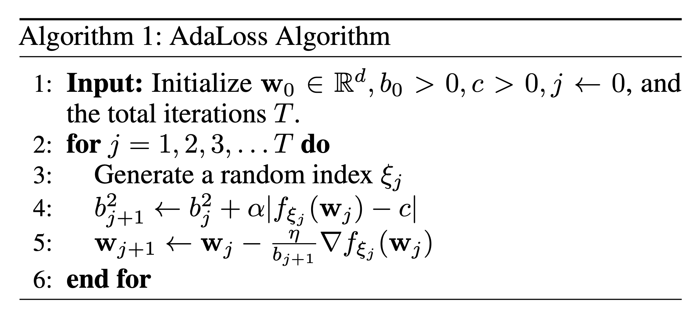

# AdaLoss: A computationally-efficient and provably convergent adaptive gradient method

This repository is the official implementation of [AdaLoss: A computationally-efficient and provably convergent adaptive gradient method](https://arxiv.org/pdf/2109.08282.pdf) (AAAI 2022).
- 

We propose a computationally-friendly adaptive learning rate schedule, "AdaLoss", which directly uses the information of the loss function to adjust the stepsize in gradient descent methods. We prove that this schedule enjoys linear convergence in  linear regression.
Moreover, we provide a linear convergence guarantee over the non-convex regime, in the context of two-layer over-parameterized neural networks. If the width of the first-hidden layer in the two-layer networks is sufficiently large (polynomially), then AdaLoss converges robustly *to the global minimum* in polynomial time. We numerically verify the theoretical results and extend the scope of the numerical experiments by considering applications in LSTM models for text clarification and policy gradients for control problems.

## AdaLoss Algorithm (we let c=0, alpha=1)


## Requirements
- The implementation is based on Python 3
- To install requirements:

```setup
pip install -r requirements.txt
```

## Data and Pre-trianed Models
When running the following training scripts, the code will download CIFAR100 datasets and pretrianed models automatically. We also list the source of data and pretrained models below. 
### Source of Data:
- [CIFAR100](https://www.cs.toronto.edu/~kriz/cifar.html)
### Source of Pre-trained Models: 
The scripts load pre-trianed models from the awesome pytorch image models (timm).
- [PyTorch Image Models (timm)](https://github.com/rwightman/pytorch-image-models).

## Training (Fine-tuning)
- Code for AdaLoss is implementated in ```loss.py```
- Code for training is in ```train.py``` with the following options:
```
usage: python.py [-c] [--model pretrained model] [--lr learning rate] [--epochs training epochs] [--weight_decay weight_decay] [--b0 initial learning rate parameter] [--adanormb0 b0 for adagrad_norm] [--alpha alpha in AdaLoss] [--cc c in AdaLoss] [--momentum optimizer momentum] [--bs training batch_size] [--seed random seed] [--name experiment name]
```
- Options ```--b0, --alpha``` and ```--cc``` are $b_0$, $\alpha$ $c$ in AdaLoss' algorithm with c=0 and alpha=1 as defaults.
- To fine-tuning the pre-trianed deep neural network model---ViT S/16 (vision transformer)---on CIFAR100 as the experiments in the paper, run this command:

```train
python train.py -c ./configs/config_cifar100_adaloss.json --model vits16r224 --b0 1 --lr 0.1 --epochs 10 --weight_decay 1e-4 
python train.py -c ./configs/config_cifar100_sgd_b0.json --model vits16r224 --b0 1 --lr 0.1 --epochs 10 --weight_decay 1e-4
python train.py -c ./configs/config_cifar100_sgd_sqrt.json --model vits16r224 --b0 1 --lr 0.1 --epochs 10 --weight_decay 1e-4
python train.py -c ./configs/config_cifar100_adagrad_norm.json --model vits16r224 --adanormb0 1 --lr 0.1 --epochs 10 --weight_decay 1e-4   
```
- To fine-tuning the ResNet50-swsl model, parse ```--model swsl_resnet50```

## Results

Comparison of AdaLoss (ours), AdaGrad-Norm, SGD_Constant, SGD_DecaySqrt on test accuracy on CIFAR100 by fine-tuning on pretrained DNNs, vision transformer ViT-S/16 and ResNet50-swsl. 
Training: 45k, validation: 5k, and test: 10k. The results are mean and std over 5 runs.

### [Image Classification on CIFAR100](https://www.cs.toronto.edu/~kriz/cifar.html)
- With pretrained vision transformer, ViT-S/16

| b_0  | AdaLoss        | AdaGrad-Norm   | SGD\_Constant  | SGD\_DecaySqrt |
|--------|----------------|----------------|----------------|----------------|
| 0.01   | 90.62±0.20 | 61.79±2.42 | N/A            | 90.48±0.07 |
| 0.1    | 90.79±0.04 | 86.59±0.09 | N/A            | 90.35±0.20 |
| 1      | 90.77±0.12 | 89.20±0.20 | 82.98±0.26 | 90.66±0.06 |
| 10     | 90.45±0.02 | 90.57±0.38 | 90.43±0.08 | 90.54±0.08 |
| 100    | 89.54±0.11 | 89.93±0.11 | 89.88±0.08 | 89.55±0.08 |

- With pretrained CNN, ResNet50-swsl

| b_0    | AdaLoss        | AdaGrad-Norm   | SGD_Constant   | SGD_DecaySqrt  |
|--------|----------------|----------------|----------------|----------------|
| 0.01   | 90.77±0.12 | 62.22±1.47 | N/A            | 90.50±0.21 |
| 0.1    | 90.78±0.03 | 86.61±0.38 | N/A            | 90.57±0.08 |
| 1      | 90.65±0.26 | 88.98±0.45 | 82.73±1.17 | 90.61±0.11 |
| 10     | 90.56±0.25 | 90.67±0.15 | 90.46±0.26 | 90.60±0.08 |
| 100    | 89.51±0.0  | 89.80±0.12 | 89.75±0.09 | 89.43±0.13 |


## License 
- This repo was adapted and modified from [ELR](https://github.com/shengliu66/ELR).
- This README is formatted based on [releasing-research-code](https://github.com/paperswithcode/releasing-research-code).

## Bibtex
```@article{wu2021adaloss,
title={AdaLoss: A computationally-efficient and provably convergent adaptive gradient method},
author={Wu, Xiaoxia and Xie, Yuege and Du, Simon and Ward, Rachel},
journal={arXiv preprint arXiv:2109.08282},
year={2021}
}
```
